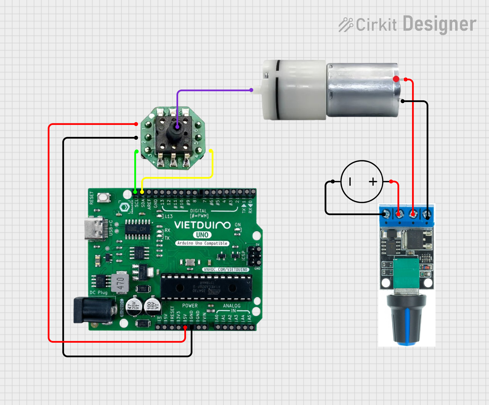

# Phần cứng
1. [Vietduino Uno ATmega328P](https://hshop.vn/vietduino-uno-atmega328p)
2. [Động cơ bơm khí 370 Air Pump Motor 12VDC](https://hshop.vn/dong-co-dc-bom-370-air-pump-12vdc)
3. [Nguồn Power Adaptor AC-DC 12V 2A](https://hshop.vn/nguon-power-adaptor-ac-dc-12v-2a)
4. [Dây DC Cái 5.5 x 2.1mm Female DC Power Jack Wire](https://hshop.vn/day-dc-cai-5-5-2-1-mm)
5. [Mạch điều khiển tốc độ động cơ Mini PWM DC Motor Speed Controller 10A](https://hshop.vn/mach-dieu-khien-toc-do-dong-co-mini-pwm-dc-motor-speed-controller-10a)

# Phần mềm
1. ArduinoIDE
2. Driver [chip nạp code (CH340)](https://sparks.gogo.co.nz/ch340.html)
# Sơ đồ kết nối

# Logic của chương trình
BƯỚC 1: Gửi lệnh đo lường (0xAC 0x12) (Xử lý lỗi truyền I2C nếu cần)

BƯỚC 2: Chờ 80ms để cảm biến hoàn tất phép đo

BƯỚC 3: Yêu cầu đọc 3 byte dữ liệu (DATA0, DATA1, CRC)

BƯỚC 4: Tính toán và kiểm tra CRC. CRC là kết quả của DATA0 XOR DATA1 [24, Bảng 5]

BƯỚC 5: Chuyển đổi dữ liệu thành giá trị áp suất
- Ghép 2 byte dữ liệu thành giá trị 16 bit (kPa * 10)
- Ép kiểu thành số nguyên có dấu 16 bit (Signed Short Int) để xử lý áp suất âm (nếu có, ví dụ AGR12xxPxx hoặc AGR12xxNxx)
- Chia cho 10.0 để có giá trị áp suất thực tế (kPa)

BƯỚC 6: Hiển thị kết quả
- Số byte Uno đọc được (biến count)
- Dữ liệu thô sau khi đã ghép 2 byte dữ liệu thành giá trị 16 bit (kPa * 10) | Giá trị áp suất thực tế

# Hướng dẫn nạp code với ArduinoIDE
1. Trỏ đường dẫn sketch book đến thư mục chứa chương trình trong  File/Preferences

2. Chọn chương trình "I2C_AGR12_Pressure_Sensor_Uno" tại File/Sketchbook/examples/

3. Board chọn Arduino Uno, Chọn PORT tương ứng với cổng COM của mạch Arduino (kiểm tra tại Device Manager)
_Kiểm tra COM tại Device Manager_

_Chọn board_

4. Bấm Upload để nạp code

